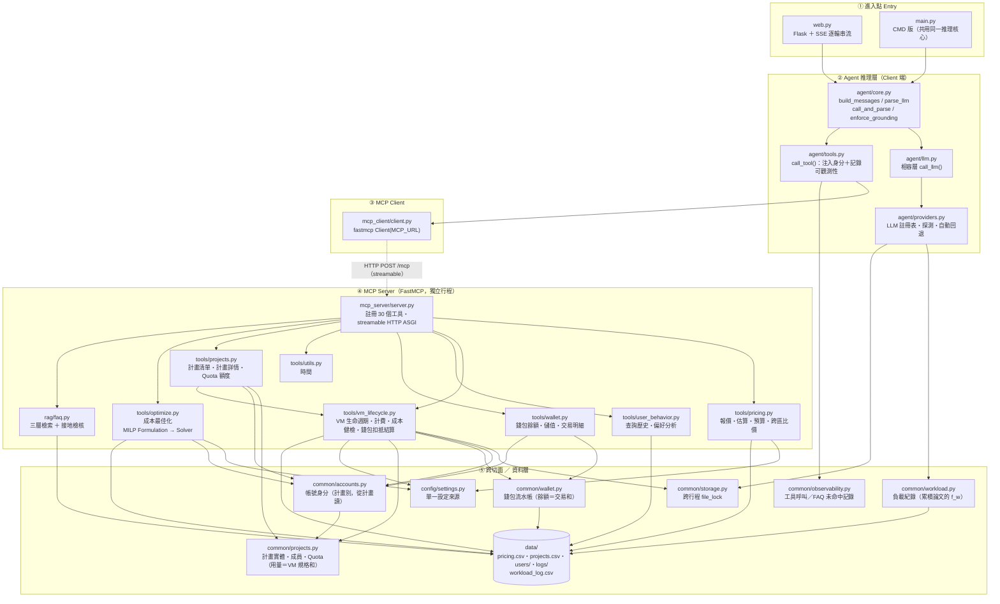
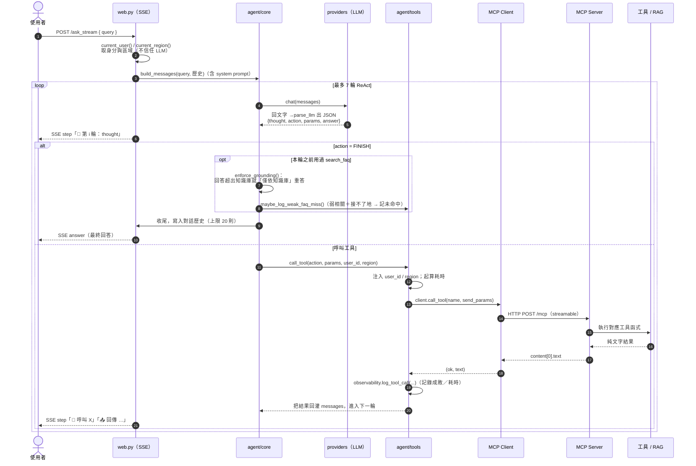
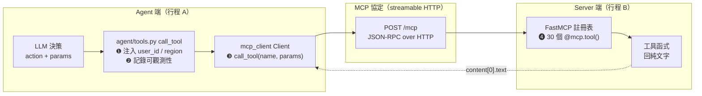
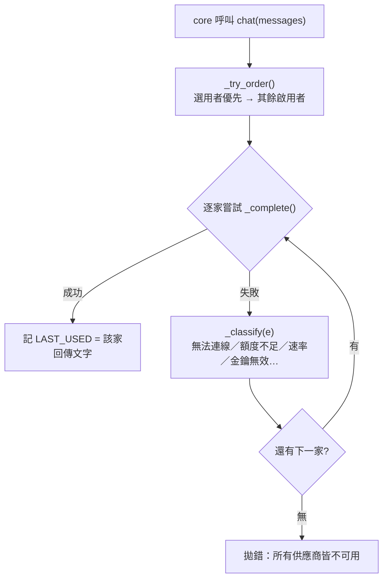
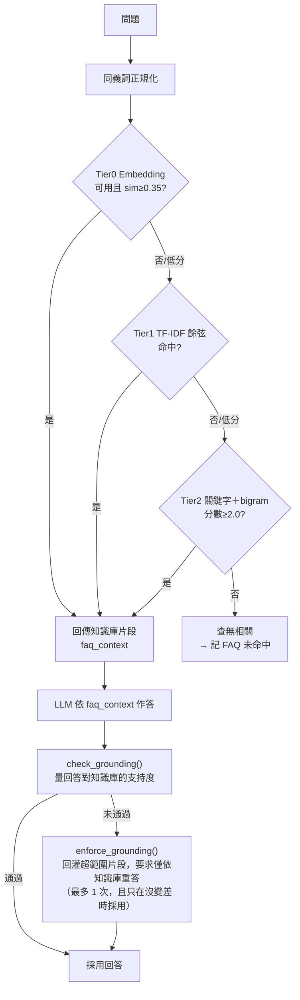
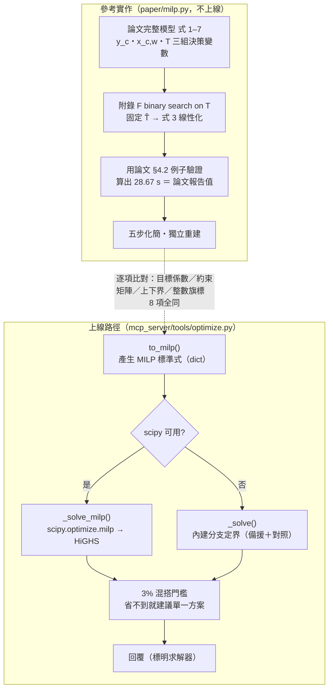

# 系統架構與執行 Pipeline

| 項目 | 內容 |
| --- | --- |
| 文件版本 | 1.0（2026-08-21） |
| 適用範圍 | 可信賴雲 AI Agent 原型全系統 |
| 對象 | 接手維護者、審閱者 |

## 摘要

本系統是一個以 MCP（Model Context Protocol）串接「LLM 推理」與「工具執行」的雲端
方案 AI Agent。LLM 僅負責決策——判斷應呼叫哪個工具、如何組織回答；實際動作一律由
MCP Server 上的工具執行，兩者之間以 MCP 協定溝通

所有金額與最佳化結果均在 Server 端計算完成後才交給 LLM 轉述，LLM 不執行算術
此設計使金額具可稽核性：每一筆數字都能追溯到特定工具的特定輸入

本文說明系統由哪些元件組成、一則請求從進入到回答之間的完整流程，以及 MCP 在其中
承擔的角色。各流程圖後附「對應程式碼」，為節錄自實際原始碼；為聚焦主線，邊界處理
與串流事件以 `…` 省略，完整版見對應檔案

## 目次

| 節 | 內容 |
| --- | --- |
| §1 | 元件架構 |
| §2 | 端到端執行 Pipeline |
| §3 | MCP 協作項目 |
| §4 | LLM 供應商協作 |
| §5 | RAG／FAQ Pipeline |
| §6 | 成本最佳化 Pipeline |
| §7 | 資料流與持久化 |
| §8 | 資料隔離與可觀測性 |
| §9 | 對照真實環境的接點 |

---

## 1. 元件架構



**對應程式碼**——Server 註冊工具、Client 連線：

```python
# mcp_server/server.py — 把普通函式註冊成 MCP 工具
mcp = FastMCP("可信賴雲助手")
mcp.tool()(query_pricing)
mcp.tool()(estimate_cost)
mcp.tool()(optimize_plan_mix)
mcp.tool()(create_vm)
…                                       # 共 30 個
app = mcp.streamable_http_app()          # 產生 ASGI app，交給 uvicorn 服務

# mcp_client/client.py — Agent 端連往 Server 的薄封裝
def get_client() -> Client:
    return Client(settings.MCP_URL)      # MCP_URL = http://127.0.0.1:8000/mcp
```

**分層責任**

| 層 | 模組 | 職責 | 為什麼這樣切 |
| --- | --- | --- | --- |
| ① 進入點 | `web.py` / `main.py` | 接使用者輸入、跑推理迴圈、輸出 | Web/CMD 共用同一推理核心，不重複邏輯 |
| ② 推理層 | `agent/core.py`、`llm.py`、`providers.py`、`tools.py` | 組裝 prompt、呼叫 LLM、解析輸出、決定呼叫哪個工具 | 換 LLM 供應商不影響工具層 |
| ③ MCP Client | `mcp_client/client.py` | 與 Server 建立連線、`list_tools` / `call_tool` | 收斂成薄封裝 |
| ④ MCP Server | `mcp_server/server.py` ＋ `tools/*`、`rag/faq.py` | 註冊並執行工具，對外以 HTTP 服務 | 工具與推理分離，可獨立部署與測試 |
| ⑤ 跨切面 | `config`、`common/*` | 設定、鎖、身分、記錄，被各層共用 | 資料存取／身分／記錄集中 |

---

## 2. 端到端執行 Pipeline

核心是一個 **ReAct 迴圈**（Reason → Act → Observe，最多 7 輪；`web.py:341` `for i in range(1, 8)`）：



**對應程式碼**——`web.py:run_agent_stream()` 的迴圈本體：

```python
async with get_client() as client:
    for i in range(1, 8):                          # 最多 7 輪 ReAct
        d = call_and_parse(messages)               # ① LLM 推理 → 解析出 JSON 決策
        action, params = d.get("action"), d.get("params", {})

        if action == "FINISH":                     # ② 收尾
            answer = d.get("answer", "")
            if faq_context:                        #    用過知識庫才做忠實度檢核
                answer, g, attempts = enforce_grounding(messages, d, faq_context)
                maybe_log_weak_faq_miss(user_input, faq_context, g, user_id)
            history.append({"role": "user", "content": user_input})
            history.append({"role": "assistant", "content": answer})
            await queue.put({"type": "answer", "text": answer})
            return

        # ③ 呼叫工具（唯一入口，見 §3）
        ok, result = await agent_tools.call_tool(client, action, params, user_id, region)
        if ok and action == "search_faq":
            faq_context = result                   #    記住知識庫片段，供 FINISH 檢核
        messages += [                              # ④ 把工具結果回灌，進入下一輪
            {"role": "assistant", "content": json.dumps(d, ensure_ascii=False)},
            {"role": "user", "content": f"Tool {action} 回傳：\n{result}\n請繼續推理。"},
        ]
```

**逐步說明**

| 步驟 | 發生什麼 | 位置 |
| --- | --- | --- |
| 進場 | `/ask_stream` 收到 query，先用 `current_user()` / `current_region()` 定身分與區域 | `web.py:461` |
| 組訊息 | system prompt ＋ 歷史 ＋ 本次輸入 | `agent/core.py:build_messages` |
| 推理 | 呼叫 LLM → 解析出 `{thought, action, params}` | `core.py:call_and_parse` |
| 串流 | 每輪把 thought／tool／result 以 SSE 事件推給前端，肉眼可見推理過程 | `web.py:run_agent_stream` |
| 執行工具 | 走 `agent/tools.py:call_tool` | `web.py:395` |
| 觀測 | 回灌工具結果、記一筆工具呼叫；若是 `search_faq` 記住 `faq_context` | `web.py:399` |
| 收尾 | `FINISH` → 忠實度檢核 → 寫歷史 → 回答 | `web.py:363` |

**兩個保護閘**：
- **輪數上限 7**：避免 LLM 無限繞圈；到頂就回「請換個方式描述」
- **忠實度檢核**：用過知識庫才啟動，回答不可超出知識庫

---

## 3. MCP 協作項目

「Agent 決定要呼叫工具」到「工具真的被執行」中間，經過四個協作環節



**對應程式碼**——`agent/tools.py:call_tool()`：

```python
async def call_tool(client, tool, params, user_id="default", region=None):
    send_params = dict(params or {})
    if tool in USER_SCOPED_TOOLS:                       # ❶ 身分：一律強制覆蓋
        send_params["user_id"] = user_id                #    （LLM 給的任何值都被蓋掉）
    if region and tool in REGION_SCOPED_TOOLS and not send_params.get("region"):
        send_params["region"] = region                 #    區域：只在 LLM 沒明講時補

    t0 = time.time()
    try:                                                # ❸ 傳輸：一次 MCP 呼叫
        res = await client.call_tool(tool, send_params)
        text, ok = res.content[0].text, True            # ❹ Server 回純文字，取出來
    except Exception as e:
        text, ok = f"失敗：{e}", False                   #    失敗不拋例外，回灌給 LLM 自癒
    latency_ms = (time.time() - t0) * 1000

    observability.log_tool_call(user_id, tool, params, ok, latency_ms, text)  # ❷ 記錄
    return ok, text
```

### ❶ 身分與區域注入（上碼的前兩個 `if`）
`agent/tools.py:call_tool` 是**全系統唯一呼叫工具的入口**

- **`user_id` 一律由執行期覆蓋，不讓 LLM 決定**
- `user_id` 來源是 `web.py:current_user()`

### ❷ 可觀測性記錄
每次呼叫都用 `observability.log_tool_call(user_id, tool, params, ok, latency_ms, text)` 寫一筆
（工具名、參數、成敗、耗時、結果摘要）到 `data/logs/tool_calls.jsonl`，管理介面 `/admin` 可查
失敗時不拋出例外，改回傳 `(False, 錯誤訊息)`，由推理迴圈將錯誤回饋給 LLM 修正

### ❸ 傳輸（Client ↔ Server）
- Client：`mcp_client/client.py` 用 `fastmcp.client.Client(settings.MCP_URL)`，以 `async with` 取得連線
- 連線端點：`MCP_URL = http://127.0.0.1:8000/mcp`（`config/settings.py`）。
- 協定：**MCP streamable HTTP**（JSON-RPC over HTTP），由 FastMCP 兩端各自處理序列化
- 對外操作只有兩個：`list_tools()`與 `call_tool(name, params)`。

### ❹ Server 端註冊與執行
- `mcp_server/server.py` 建 `FastMCP("可信賴雲助手")`，用 `mcp.tool()(fn)` 把 **函式**註冊成 MCP 工具；
  函式的 **docstring 直接變成工具說明**，型別註記變成參數 schema
- `app = mcp.streamable_http_app()` 產生 ASGI app，由 `uvicorn` 服務
- 工具函式一律**回純文字**；Client 端取 `res.content[0].text`

### 30 個工具一覽（依作用域）

| 類別 | 工具 | 使用者隔離 | 區域參數 |
| --- | --- | :---: | :---: |
| 報價 | `query_pricing` / `recommend_server` / `compare_plans` | | ✔ |
| 估算 | `estimate_cost` / `estimate_storage_cost` / `plan_budget` | ✔ | ✔ |
| 比價 | `compare_regions`| ✔ | |
| **最佳化** | `optimize_plan_mix` | ✔（ | ✔ |
| 行為 | `log_query` / `get_user_history` / `get_recommendations` / `analyze_usage` | ✔ | |
| VM | `create_vm` / `start_vm` / `stop_vm` / `maintain_vm` / `delete_vm` / `list_vms` / `get_vm` | ✔ | 建立時 ✔ |
| 計費 | `get_vm_bill` / `get_account_bill` / `suggest_savings` | ✔ | |
| 錢包 | `get_wallet_balance` / `top_up_wallet` / `list_transactions` | ✔ | |
| 計畫/Quota | `list_projects` / `get_project` / `get_quota` | ✔ | |
| 知識庫 | `search_faq` | ✔ | |
| 一般 | `get_current_time` | | |

> `USER_SCOPED_TOOLS` / `REGION_SCOPED_TOOLS` 兩個集合（`agent/tools.py`）

---

## 4. LLM 供應商協作

不綁單一 LLM。`agent/providers.py` 維護一份供應商註冊表（`settings.LLM_PROVIDERS`：本地 LLM／Claude／OpenAI），
支援探測狀態、切換、以及**呼叫時自動回退**。



**對應程式碼**——`agent/providers.py`：

```python
def _try_order():                          # 選用者優先，其餘啟用者依設定順序遞補
    aid = active_id()
    return ([aid] if aid else []) + [p["id"] for p in settings.LLM_PROVIDERS
                                     if p["enabled"] and p["id"] != aid]

def chat(messages):
    global LAST_USED
    errs = []
    for pid in _try_order():
        p = get_provider(pid)
        try:
            txt = _complete(p, messages)        # 依 kind 走 anthropic / openai 相容格式
            LAST_USED = (p["id"], p["label"])   # 記下實際由誰回答（UI 會標示自動換家）
            return txt
        except Exception as e:
            errs.append(f"{p['label']}={STATUS_ZH.get(_classify(e), 'error')}")  # 歸類狀態
    raise RuntimeError("所有 LLM 供應商皆不可用：" + "；".join(errs))
```

- **狀態分類**（7 種）：可用 / 無法連線 / 金鑰無效(401) / 額度不足(429+quota) / 速率受限(429) / 未啟用 / 套件未安裝
  管理介面與切換結果直接顯示這些狀態。
- **跨行程一致**：目前選用哪一家寫在 `data/llm_state.json`（用 `file_lock` 保護），Web/Agent 與 Server 端的
  `analyze_usage` 都讀同一份，切換即時生效
- **UI 誠實標示**：若選用的家連不上、實際由別家回答，前端會顯示「 選用的 X 無法使用，已自動改用 Y」
  （`web.py:349`，比對 `providers.LAST_USED`）。
- **Anthropic vs OpenAI 相容**：`_complete()`
  上層 `build_messages` 
---

## 5. RAG／FAQ Pipeline

概念／說明性問題



**對應程式碼**——檢索退層（`rag/faq.py`）：

```python
_TIERS = [("embedding", _embed_retrieve), ("tfidf", _tfidf_retrieve),
          ("keyword", _keyword_retrieve)]

def retrieve(query, top_k=2):
    items = _load_faq()
    for name, fn in _TIERS:
        try:
            hits = fn(query, items, top_k)   # 該層「可用但查無」→ 回空，尊重結果、不再退
            _LAST_BACKEND = name
            return hits
        except Exception:
            continue                          # 該層「不可用」（拋例外）才往下退一層
    return []
```

**對應程式碼**——接地檢核與重答（`rag/faq.py` ＋ `agent/core.py`）：

```python
def check_grounding(answer, context, min_overlap=0.45, min_score=0.6):
    segs = _split_segments(answer)            # 回答切成短句
    ctx = _char_bigrams(context)
    flagged, supported = [], 0
    for s in segs:                            # 逐句量與知識庫的字元 bigram 重疊
        g = _char_bigrams(s)
        overlap = len(g & ctx) / len(g) if g else 1.0
        if overlap >= min_overlap:
            supported += 1
        else:
            flagged.append(s)                 # 重疊太低 → 疑似超出知識庫
    score = supported / len(segs)
    return {"score": round(score, 2), "ok": score >= min_score, "flagged": flagged}

def enforce_grounding(messages, finish_dict, faq_context, max_retries=1):
    answer = finish_dict.get("answer", "")
    g = check_grounding(answer, faq_context)
    attempts = 0
    while not g["ok"] and attempts < max_retries:
        attempts += 1
        d = call_and_parse(messages + [ … 回灌 g["flagged"]，要求「僅依知識庫」重寫 … ])
        new_g = check_grounding(d.get("answer", ""), faq_context)
        if new_g["score"] >= g["score"]:      # 只在「沒變差」時才採用新版，避免越改越糟
            answer, g = d.get("answer", ""), new_g
        else:
            break
    return answer, g, attempts
```
---

## 6. 成本最佳化 Pipeline

「給定預算與資源需求，開哪些方案、各幾台，總花費最低？」——`recommend_server` 
只能在既有方案中挑**一個**，答不出需要混搭的題目`mcp_server/tools/optimize.py` 

模型出自 **對異質 GPU 做成本最佳化的 MILP**
論文完整模型（GPU 組成 / 部署配置 / 工作負載分派），目標是最小化 makespan，
但其中的吞吐量係數 `h(c,w)` **必須由 GPU profiling 取得**（論文附錄 L）。
本專案當時無測試環境，因此走「**先完整程式化、再逐步化簡**」的路徑
**每一步化簡都只因為「輸入取不到」或「場景不適用」**。



### 論文模型 → 本專案模型

| 步驟 | 移除項目 | 移除原因 |
| --- | --- | --- |
| ① | `h(c,w)` 吞吐量 | 並非無法取得（已實測且達飽和），而是僅取得**單一配置**（`\|C\| = 1`，非矩陣）→ 式 3 只剩一條、無從比較配置優劣 → `min T` 無選擇空間 |
| ② | 目標 `min T` | 換成總成本。論文自己就有 `o_c = Σ(d_n × p_n)`，只是拿來當約束 5——**從約束升為目標** |
| ③ | `x_c,w` 分派 | `\|C\| = 1` 時 `x_{1,w} ≡ 1`，式 2 恆成立、式 4 恆滿足 → 兩式自動消失。更根本的一層：本平台的決策是「租哪些機器」不是「請求送到哪個副本」；式 2「須被完全滿足」改寫成資源覆蓋約束 |
| ④ | `s_c` 平行策略 | 論文的 `c` 是「一個模型副本怎麼部署」，`s_c` 長度＝PP 段數、元素＝該段 TP 度，DP 則是 `y_c`。這三者由**跑模型的人**決定；本平台是 VM 租用，租走後跑什麼平台不介入 → 配置 `c` 換成**平台的資源配置**（H100 幾張／vCPU 幾核／RAM 幾 GB／磁碟幾 GB），`\|C\| = N`、`y_c → x_n` |
| ⑤ | 庫存 `a_n`（式 6） | 配額制無即時庫存波動 → 換成台數上限 `Σ x_n ≤ K` |

化簡後的模型——**所有係數只來自 `data/pricing.csv` 與折扣設定，可完全離線驗證**：

```
決策變數  x_n ∈ ℤ≥0（第 n 個方案開幾台）、s ∈ ℝ≥0（加購磁碟 GB）
目標函數  min Σ_n ( p_n × x_n ) ＋ r × s
覆蓋約束  Σ v_n·x_n ≥ V ／ Σ m_n·x_n ≥ M ／ Σ g_n·x_n ≥ G ／ s ≥ D
其他約束  Σ p_n·x_n ＋ r·s ≤ B ÷ 總時數（預算）　Σ x_n ≤ K（台數上限）
```

**對應程式碼**——`optimize.to_milp()`，同一份 dict 給求解器：

```python
# 目標函數   min  Σ_n ( p_n × x_n ) ＋ r × s
c = [p["單價"] for p in plans]            # ← p_n，折扣後時價
if has_disk:
    c = c + [disk_rate_h]                 # ← r，磁碟每 GB 每小時

# 覆蓋約束   Σ v_n·x_n ≥ V ／ Σ m_n·x_n ≥ M ／ Σ g_n·x_n ≥ G
for key, need, label in (("vcpu", need_vcpu, "vCPU 需求"), …):
    if need > 0:                          # 需求為 0 的那項「整條約束不存在」，不是填 0
        rows.append(_row([p[key] for p in plans]))
        lb.append(float(need)); ub.append(math.inf)

# 磁碟約束   s ≥ D  （系統碟不折抵：綁在各自機器上、無法跨機器合併成單一磁碟區）
if has_disk:
    rows.append(_row([0.0] * n, disk_coef=1.0))
    lb.append(float(need_disk)); ub.append(math.inf)

# 整數約束   x_n 整數、s 連續 → 真正的 Mixed-Integer
"integrality": [1] * n + ([0] if has_disk else [])
```

### 三項設計決定與其取捨

- **系統碟刻意不折抵**（`s ≥ D`，不寫成 `Σ d_n·x_n + s ≥ D`）：系統碟綁在各自機器上
  **無法跨機器合併成一顆磁碟區**；折抵亦會產生「以低價機型累積免費系統碟」的錯誤誘因
  代價是報價**偏保守**——對計價工具而言，寧可保守也不能低估
  附帶好處：最省加購量有封閉解 `s* = D`，**磁碟不進搜尋樹**，加一個維度不增加求解成本
- **儲存折扣兩區規則不同**：AI-Cloud 計算與儲存都有差別費率折扣
  **AI-Trust 只有計算有折扣、儲存是單一價**（qa_code=839）。寫成兩區都打折會低估 AI-Trust 報價
  `test_optimize.py` 有一項專門守這條
- **3% 混搭門檻**：省不到 3% 就改建議單一方案。無限制的成本最小化會給出**運維不可行**的解
  實測：純 CPU/RAM 情境混 4 種機型只省 **0.1%（$36）**
  GPU 情境才有 **6.1%（$7,668）**

### 求解器選型與降級路徑

`_solve_milp()` 走 `scipy.optimize.milp`（底層 **HiGHS**，branch-and-bound ＋ cutting planes）
**論文只指定 `branch-and-bound` 這個演算法類別（p7），沒有指名任何求解器**；cutting planes 是 HiGHS 的
實作特性，論文未提。選 HiGHS 是本專案的工程判斷，依據是下方的三方交叉驗證與耗時量測
**零新依賴**——scipy 本專案已在用。沒有 scipy 時退回 `_solve()` 
自寫的分支定界：分支（依序決定各方案台數，由多到少）／定界（剩餘需求 ÷ 各資源最佳每元效率，三項取最大）／
剪枝（現成本 ＋ 下界 ≥ min(當前最佳, 預算) 就整支剪掉）。**下界保證不高估 → 求得的是精確最佳解**
節點數超過 40 萬即停並如實標註「未必全域最佳」
回覆一律標明求解器

> 自行實作的分支定界並非求解器的替代方案，而是獨立的正確性對照
> 僅有單一求解路徑時，模型設定錯誤不會被察覺

### 三方交叉驗證

> 下表為專案期間以基準測試工具量得的結果。該工具屬開發期用途，未隨本次交付提供，
> 因此數據為既有紀錄，無法於交付版本中重跑。`scripts/test_optimize.py` 的 40 項
> 仍涵蓋其中的成本正確性與磁碟／預算／折扣規則。

| 情境 | 搜尋空間 | B&B 展開節點 | 成本 | HiGHS / B&B |
| --- | ---: | ---: | ---: | ---: |
| 8 核 / 32GB | 4,320 | 57（1/75） | $11.52　三方 ✅ | 9.9 / 0.1 ms |
| 32 核 / 64GB | 771,750 | 476（1/1,621） | $38.42　三方 ✅ | 4.6 / 0.3 ms |
| 64 核 / 256GB | 119,574,225 | 8,489（1/14,085） | $92.19　兩方 ✅ | 5.1 / 5.1 ms |
| 96 核 / 512GB / 2 張 | 271,194,342,300 | 50,201（1/5,402,170） | $164.31　兩方 ✅ | 5.1 / 38.9 ms |
| 含磁碟 8 核 / 32GB / 200GB | 4,320 | 57（1/75） | $11.95　三方 ✅ | 6.0 / 0.1 ms |
| 含磁碟 64 核 / 256GB / 500GB | 119,574,225 | 8,489（1/14,085） | $93.26　兩方 ✅ | 5.1 / 5.3 ms |
| 含磁碟 96/512/2 張/1TB | 271,194,342,300 | 50,201（1/5,402,170） | $166.45　兩方 ✅ | 6.3 / 39.6 ms |

「三方」＝ HiGHS／內建 B&B／窮舉三條獨立路徑成本相同；「兩方」＝ 規模過大、窮舉跑不動
（組合數 `Π(k_n+1)`，最大情境 2,712 億種）
後三列加了磁碟維度，**搜尋空間與展開節點數與對應的無磁碟情境完全相同**
即「磁碟不進搜尋樹」的實測（`disk_gb=0` 時前四列成本與加入 storage 前分毫不差）
HiGHS 耗時幾乎不隨規模成長（5～10 ms，多數為建模的固定開銷），自行實作者則由 0.1 ms
增至 38.9 ms。正式路徑採用求解器係基於上述量測結果

### 吞吐量係數 `h(c,w)`

`paper/profile_vllm.py --run` 對可連的 vLLM endpoint 送受控負載，量到了論文的 `h(c,w)`

| 日期 | 併發 | 結果 | 判定 |
|---|---|---|---|
| 08-15 | 1／2／4，每組 8 請求 | h = 4.00 / 0.383 / 0.180 | ❌ 吞吐仍以 62–91% 成長，是**下界** |
| 08-16 | 16／32／64，每組 64 請求 | h = 8.40 / 0.945 / 0.379 | ✅ 三種負載全部持平，**已飽和** |

論文 Table 2 定義 `h` 為 `throughput of config c on workload w`，附錄 L 說 prefill／decode 算的是
**batched processing capacity**（容量，不是觀測值）。「沒推到飽和量到的就不是 `h`」是本專案的推論
論文沒有「最大可持續吞吐量」這個字面。下界填進模型會低估副本能力
→ 高估要開幾份 → 報價偏高，推到飽和後 `h` 平均是原本的 **2.1 倍**
這個差別不是小數點後的問題，飽和後的真實天花板是**輸出 150～240 tok/s**

**補格子的模型隨 regime 換掉**

- **未飽和**用延遲拆解（論文附錄 L 的作法）：`h = 併發 ÷ ( a×輸入 + b×(輸出−1) )`，
  誤差 **≤2.1%**。同一組係數還預測了該 server 累積的 **30,843 筆真實請求**平均延遲
  得 1,899 ms vs 伺服器實測 1,898 ms 請求是獨立交叉驗證
- **飽和後這個模型會壞掉，誤差 94.6%**。原因是飽和時 TTFT 幾乎全是**排隊**而非計算：
  (2455,510) 併發 64 的 TTFT p50 是 62 秒，除以輸入長度得 23 ms/token
  比未飽和時的 0.7 ms/token 高 33 倍
- **飽和用服務率模型**：`1 ÷ h = α×輸入 + β×輸出`，量的是「每個請求佔用多少服務時間」而非延遲
  誤差 **≤11.4%**，與論文附錄 L 原文「the estimation errors range from 4% to 7%」同一個數量級
  用相對加權最小二乘（h 橫跨 22 倍，等權會被慢的點主導、快的那格誤差衝到 45%）

### 上線版本的範圍限制

- **不含吞吐量維度**：`h(c,w)` 已量到一欄**且已推到飽和**，但 **`|C| = 1` 不是矩陣**
    而 `|C| = 1` 時論文的式 2、式 4 本來就恆成立
  **沒有配置可以選**。上線版只做「**成本覆蓋最佳化**」
  **無法做效能最佳化、無法改善吞吐量**
- **無法含部署配置維度**：DP/TP/PP 對應推論服務，本平台是 VM 租用
- **假設資源可線性疊加**：「2 台 32 核」視為「64 核」，未建模跨機器的網路與協調成本
- **磁碟未逐台建模**：以加購全額計價，更精確要定義成「單台要多少」並逐台建模

---

## 7. 資料流與持久化

| 檔案 | 內容 | 併發保護 |
| --- | --- | --- |
| `data/pricing.csv` | 兩區價目（Region 欄），報價/計費的單一事實來源 | 只讀（mtime 快取） |
| `data/users/<id>/vm_instances.csv` | 該使用者的 VM 與計費（**按人隔離**） | `file_lock` |
| `data/users/<id>/history.csv` | 該使用者的查詢歷史 | `file_lock` |
| `data/users/<id>/profile.json` | 目前使用中的計畫；無計畫時的自選身分 | `file_lock` |
| `data/users/<id>/wallet.jsonl` | 錢包流水帳| append |
| `data/projects.csv` | 計畫（類別／核定額度／成員／各服務 quota）；**內容為示範資料** | 只讀 |
| `data/logs/tool_calls.jsonl` | 每次工具呼叫（人／工具／參數／成敗／耗時） | append |
| `data/logs/faq_misses.jsonl` | FAQ 未命中，供補題 | append |
| `data/workload_log.csv` | 每次 LLM 生成的輸入／輸出 token 數與負載類型 | `file_lock` |
| `data/llm_state.json` | 目前選用的 LLM | `file_lock` |

- **鎖**：`common/storage.py:file_lock` 以 `O_CREAT|O_EXCL` 建 lockfile，10 秒逾時、30 秒偷走過期鎖，
  避免 Server 與其他行程同時寫壞檔。
- **計費在讀取時算**：VM 只存「牌價累計」，折扣依「當下身分 × 該 VM 區域」在查詢時套
（`vm_lifecycle` ＋`accounts.discount_for`）——所以切換身分再查帳單，同一台機器就顯示不同實收

---

## 8. 資料隔離與可觀測性

- **身分只在一處決定**：`web.py:current_user()`
  LLM **無法**影響 `user_id`（在 `agent/tools.py`）
- **每個動作可回溯**：工具呼叫、FAQ 未命中都有 jsonl 記錄，`/admin` 一頁彙整各使用者的 VM／計費工具呼叫、未命中
- **失敗可自癒**：工具錯誤回灌給 LLM 而非中斷；LLM 連不上自動換家；檢索層與 embedding 不可用自動退化
- **工具的「可達性」是獨立的一層**：`agent/core.build_messages()`
  **不送 MCP 的工具 schema**。LLM 實際能用的工具＝ `prompt/system_prompt.py` 
  
---

## 9. 對照真實環境的接點

| 要接的東西 | 接縫（只改這裡） |
| --- | --- |
| 身分驗證 / auth | `web.py:current_user()` |
| 計畫別（折扣來源） | `common/accounts.py` |
| 資料存取（換 DB） | `vm_lifecycle._read/_write_vms`、`common/storage`、`common/accounts` |
| 價目 / 費率 | `data/pricing.csv`（＋ `scripts/pricing_watch.py`） |
| 錢包 / 扣款 | `common/wallet.py`；接真實計費把 `record_charge` 改為呼叫計費 API |
| 計畫 / Quota | `common/projects.py`；接真實計畫系統改 `_rows()` |
| 工具擴充 | `mcp_server/server.py` 加 `mcp.tool()`；作用域加進 `agent/tools.py` |
| 吞吐量係數 `h(c,w)` | `paper/profile_vllm.py` 量測 → `paper/milp.py --profile` |
| 換 MILP 求解器 | `optimize._solve_milp()`；`to_milp()` 產出的標準式與求解器解耦 |
| 計畫額度進最佳化 | `optimize.to_milp()` |

---
